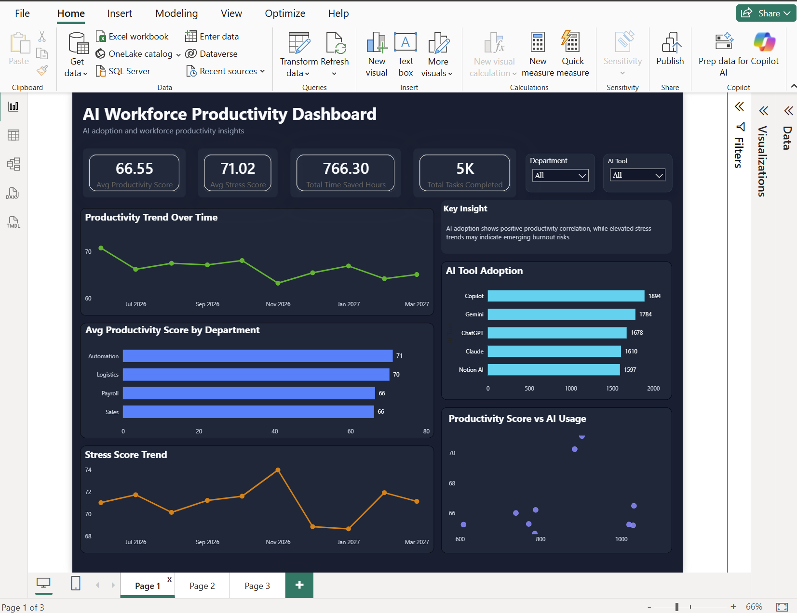
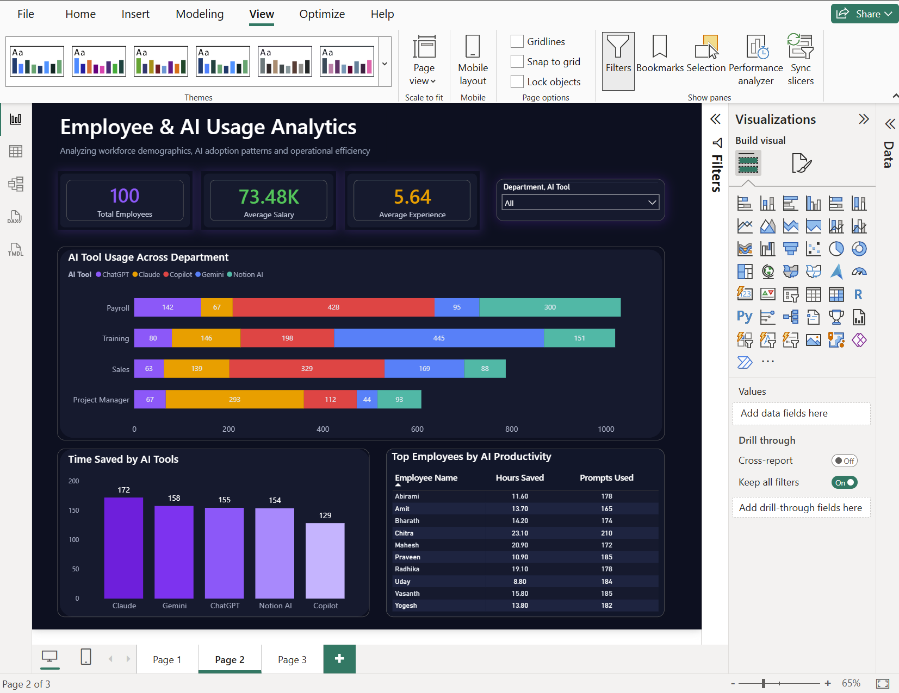
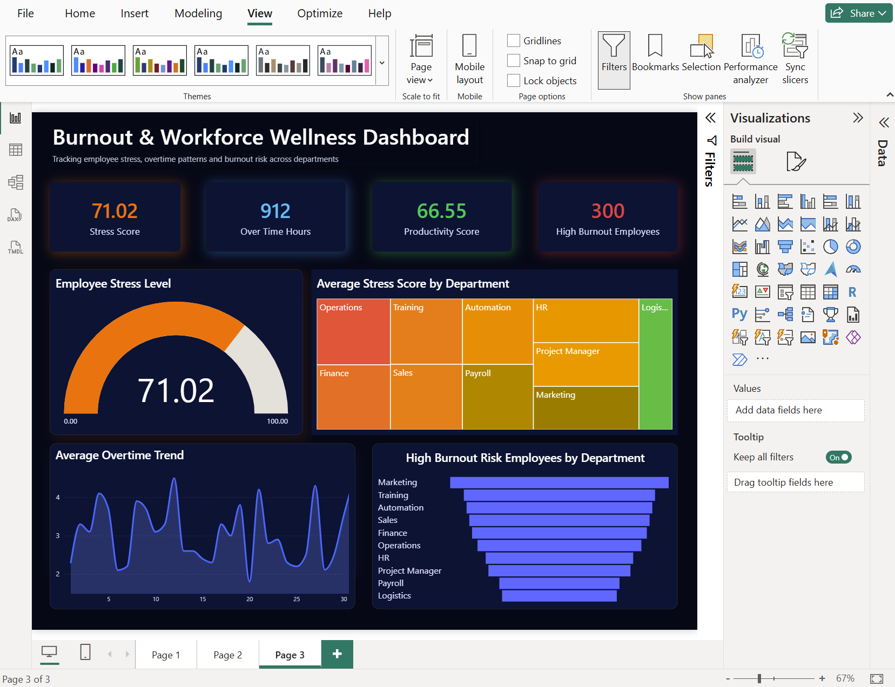

# AI Workforce Productivity & Burnout Analytics Dashboard

## Overview
This project is a 3-page interactive Power BI dashboard focused on workforce productivity, employee stress analysis, overtime trends, and burnout risk monitoring.

## Tools Used
- Power BI
- DAX
- Power Query
- Excel

## Dashboard Features
- KPI Cards
- Treemap Visualization
- Funnel Chart
- Interactive Filters
- Burnout Risk Analysis
- Productivity Monitoring

## Dashboard Preview

### Executive Overview

### Stress Analysis

### Burnout Insights

## Screenshots
(Add your dashboard screenshots here)

## Author
Yugasini B
